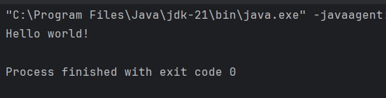

# Week 1 - Git & IntelliJ Assignment Answers

## 1. What is the use of the `git add` command?
The `git add` command is used to stage changes in your working directory for the next commit. It adds the changes to the staging area.

## 2. Write the command to create a branch “feature-login”
```bash
git branch feature-login
```

## 3. What is a pull request? Write the steps involved in creating a pull request.
A pull request is a way to propose changes to a repository and have them reviewed before merging. Steps to create a pull request:

1. Push your branch to the remote repository.
2. Navigate to the repository on GitHub.
3. Click on “New pull request”.
4. Select the branch you want to merge into the base branch.
5. Add a title and description for your pull request.
6. Click “Create pull request”.

## 4. How do you add collaborators?
To add collaborators:

1. Go to your repository on GitHub.
2. Click on “Settings”.
3. Select “Collaborators & teams”.
4. Click “Add collaborator” and enter the username of the person you want to add.
5. Click “Add collaborator” to confirm.

## 5. What is the command used to commit our changes in GitHub repo?
```bash
git commit -m "Your commit message"
```

## 6. Create a GitHub account and repository to save all your assignment tasks. Example repository name: rg-assignments

## 7. Create a branch called feature-java (you can use it later to push all your java related tasks to this branch)
```bash
git branch feature-java
```

## 8. Install IntelliJ IDE. Create a simple Java project displaying “Hello World!!” and share the screenshot.



## 9. In IntelliJ IDE, explore the shortcut keys for the following:
- To run the project: `Ctrl + F5`
- To select a line: `Ctrl + L`
- To comment/uncomment a line: `Ctrl + /`
- To delete a line: `Ctrl + Y`
